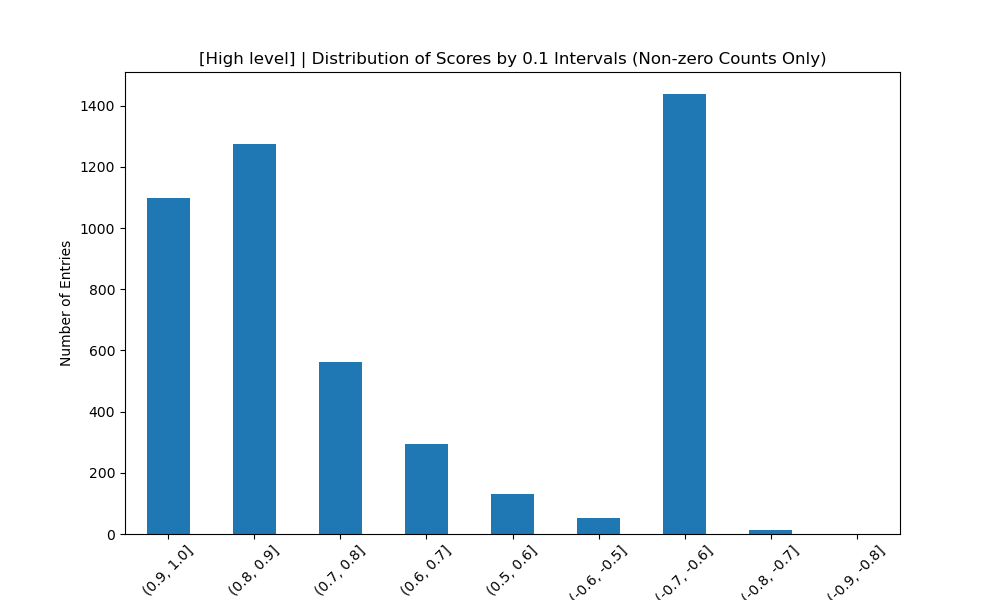

# 프로젝트 : MapleNickNameETL
1. 메이플 API부터 EMR on EKS로 이어지는 데이터 ETL 파이프라인을 구성합니다. 
2. 메이플 API를 활용하여, 약 13만개의 삭제 예정인 두글자 닉네임을 조사하여 Huggingface의 감정분석모델을 통해 분석합니다.
3. 삭제 예정인 13만개의 닉네임 중 추천 닉네임을 찾습니다.

## 아키텍처

### 구조
- Producer(ec2.t3.medium): 메이플 API로 데이터 추출 및 브로커로 전송
- Kafka broker(ec2.t3.medium): 데이터 중계 및 임시보관
- Emr on Eks(ec2.m5.xlarge * 2) : Pyspark로 데이터 컨슘 및 데이터 처리 후 S3에 저장
- Local Debug(spark): emr 작업 전, 로컬에서 빠르게 Pyspark 코드를 로컬디버깅 할 수 있는 구성
- visualize: s3에서 데이터를 프로젝트로 저장 후, 데이터 분석을 위해 데이터 시각화


### ETL 파이프라인
1. MapleAPI를 통해 랭킹 데이터를 추출
2. 랭킹 데이터를 카프카 브로커에 전송
3. Emr on Eks를 이용해 카프카 브로커에서 랭킹 데이터를 데이터프레임으로 변환 후 전처리 후 S3에 저장
4. S3에 저장된 전처리된 데이터를 읽어와 Hugginfface 모델에 인풋으로 입력
5. (4)의 결과를 다시 S3에 저장
6. s3에 저장된 데이터를 로컬에 저장 후 해당 데이터를 이용해 시각화 및 분석

## 전처리 (main_read_kafka_save_S3.py)
1. **Kafka에서 JSON 데이터 읽기**:
   - Kafka 브로커에서 ranking 토픽으로부터 배치 데이터를 읽음.
   - `value` 필드를 UTF-8로 디코딩하여 문자열로 변환.

2. **JSON 문자열 파싱**:
   - 디코딩된 JSON 문자열을 정의된 스키마 (`character_schema`와 `schema`)에 맞춰 `from_json` 함수로 파싱.
   - 이를 통해 JSON 데이터 구조가 Spark 데이터프레임의 컬럼으로 매핑.

3. **배열 컬럼  explode**:
   - `ranking` 필드가 배열로 되어 있기 때문에, `explode` 함수를 사용해 배열 내부의 각 요소를 개별 행으로 변환.

4. **필터링**:
   - 캐릭터의 `character_level` 값이 61 이하인 경우만 필터링. (삭제 조건)
   - `character_name` 필드가 두 글자인 경우만 필터링 (유저 선호 조건)

5. **컬럼 선택 및 별칭 지정**:
   - 최종 데이터프레임에서 필요한 컬럼(`page`, `character_level`, `character_name`)만 선택하고, 별칭(`level`, `name`)을 지정.

6. **CSV 저장**:
   - 최종 전처리된 데이터를 S3 경로에 CSV 형식으로 저장.
   


## 구현 -  Emr on Eks (main_model_batch.py)
허깅페이스 모델은 판다스로 구성되어있고, 이를 직렬화하면 문제가 발생하였습니다. 그렇기에 엑서큐터에서 각 파티션 마다 모델을 로드해 데이터 처리를 진행하였습니다.
또한, udf 사용 시 한 레코드 마다 모델을 불러오게 되므로, rdd 의 mappartition을 통해 파티션 당 모델이 로도되는 구조로 작성하였습니다.

소요 시간은 총 2시간 반 동안 진행되었습니다.

Eks의 구성은 m5.xlarge (4코어, 16기가 메모리, gpu x) 노드 2개이며, 스파크는 [job-run-model.json](./dockerbuild/emr_on_eks/job-run-model.json)에 적힌 성능 분배로 spark job을 실행했습니다.


### 트러블 슈팅
- 모델을 드라이버에서 로드 후 엑서큐터로 전송하는 것은 Pickle 직렬화 에러가 발생하였습니다.
- 기본 파티션이 128MB인데 비해, 총 데이터 크기 5MB이므로 파티션을 지정하여 나누지 않으면 노드 2개의 이점을 이용하지 못 할 수 있습니다.


## 결과 


<고레벨대 감정 분석 점수 분포>

<저레벨대 감정 분석 점수 분포>

`<감정 분석 모델은 유저들의 닉네임 선호 지표가 될 수 있을까?>`


메이플 고레벨 유저들에게는 닉네임 마켓등의 경로로 유저들이 선호하는 닉네임을 얻는 경향이 존재합니다.
실제로 선호되는 이름인 두글자 닉네임은 고레벨대의 유저들에게선 대략 50 퍼센트의 비율로, 일반 유저들에게서는 5퍼센트의 비율로 나타납니다.

위의 Huggingface의 감정 분석 모델 점수 분포를 통해 고레벨대 유저들에게서 높은 점수대의 분포의 비율이 높다는 것을 확인할 수 있습니다. 
따라서, 감정분석모델이 유저들의 선호하는 닉네임을 나타내는 지표 중 하나가 될 수 있음을 의미합니다.
(위의 분포 비교를 위해 추가로 고레벨 랭킹 데이터를 크롤링하였습니다).

실제로, 저레벨 닉네임 14만개 중 고득점 닉네임과 저득점 닉네임을 비교하면 아래와 같습니다.  
```
# 고점수대 : 일긴,레심,익숌,겡천,간음,손쇼,궈션,겨점,텅근,길변,요틀
# 저점수대 : 뷸뫄,뭅롸,쑴좌,쌔래,푭륩,눕좌,좝좝,봐놔,좝돠,룝좝,롸뫄
```

이 프로젝트를 통해 감정 분석 모델이 닉네임에 대한 절대적인 지표는 아니지만 의미 없는 생소한 단어를 필터링해줄 수 있는 지표가 될 수 있음을 확인했습니다.

## 향상된 역랑

- EMR on EKS를 처음 사용한 프로젝트입니다. 이 프로젝트를 통해 간편하게 eks로 k8s를 구성하고 또한 EMR을 통해 PaaS로 Pyspark 잡을 처리할 수 있었습니다.

## 느낀점

- 빠르게 컨테이너화된 분산 처리 시스템을 구축함으로써 Hadoop Eco System과 k8s의 조합의 편리함을 느낄 수 있었습니다.
- EKS 클러스터의 구성과 스파크의 자원분배에 대한 보다 적절한 구성을 갖춘다면 더욱 빠르고 경제적으로 프로젝트를 발전시킬 수 있을 것 같습니다.


## 기여도
모든 기획과 개발을 개인으로 진행하였습니다.

## 설치 및 실행
동일 디렉토리 [How to Build and Run](./HowToBuildAndRun.md)를 참고해주세요.


